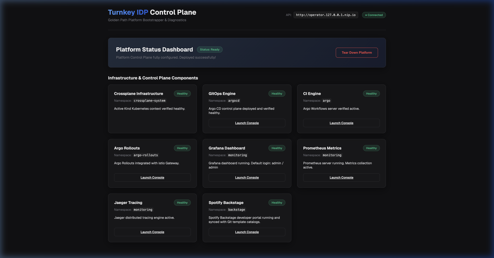
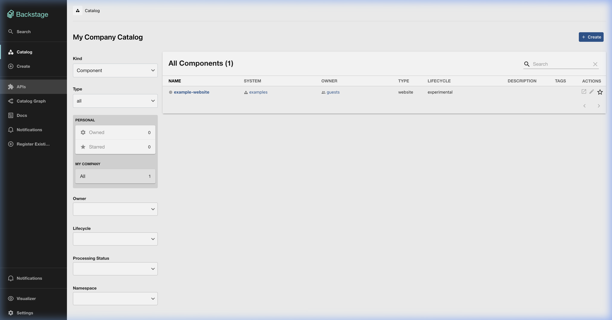

# Turnkey IDP: Unified Kubernetes Platform Control Plane

[](https://github.com/Digvijay/TurnkeyIDP/actions/workflows/publish-docker.yml)


Turnkey IDP is a fully native, in-cluster Platform Control Plane designed to bootstrap, secure, orchestrate, and observe a complete Cloud Native platform out-of-the-box. It provides a "one-tap" setup experience, removing host-machine dependencies and replacing developer manual intervention with GitOps automation.

---

## Key Value and Core Features

*   **Zero-Dependency Setup**: One shell command configures a local Kind Kubernetes cluster, sets up Istio Service Mesh with mTLS, installs Kyverno security policies, and deploys the control plane.
*   **Next.js Developer Wizard**: Interactive control console to dynamically provision GitOps engines, CI pipelines, and cloud resource compositions.
*   **Spotify Backstage Integration**: Instantly deploys and registers a Backstage Developer Portal pre-linked to all deployed metrics, tracing, and delivery services.
*   **Native AOT C# Operator**: Core reconciliation loop compiled into a high-performance Native AOT binary running on a minimal secure distroless image (~59MB total image size, booting in < 100ms).
*   **Built-in Progressive Delivery & Observability**: Argo Rollouts, Prometheus, Grafana, Jaeger, and OpenTelemetry Collector configured out-of-the-box.

---

## Use Cases

### 1. Local Platform Engineering Sandbox
Setting up a local development workspace that mimics a real enterprise Kubernetes cluster is traditionally complex. Developers and platform teams can use this repository to instantly bootstrap a local Kind Kubernetes cluster pre-loaded with Istio service mesh, Kyverno security, Argo CD, progressive delivery, and Spotify Backstage, removing host-machine configuration friction.

### 2. Control Plane Blueprint for Platform Teams
Organizations building an Internal Developer Platform (IDP) can use this control plane to orchestrate cloud infrastructure and target engines. The Helm chart can be deployed on managed cloud clusters (such as GKE, EKS, or AKS), allowing the C# operator to reconcile custom deployment configurations to provision cloud resources via Crossplane.

### 3. Reference Architecture for Kubernetes Best Practices
The repository provides a complete, working reference implementation of modern Kubernetes design patterns, including:
*   **Gateway API Ingress Routing**: Dynamic routing configuration using Gateway and HTTPRoute resources instead of legacy Ingress.
*   **Zero-Trust Service Mesh**: Istio sidecars configured with strict mutual TLS (mTLS) for all service-to-service communication.
*   **Secure Sandboxing (PSS Restricted)**: Workloads configured to run under strict Pod Security Standards (non-root users, dropped Linux capabilities, and read-only root filesystems).
*   **High-Performance Native AOT Operators**: Blueprints demonstrating how to compile .NET operator containers into minimal distroless runner images to match the low footprint and fast startup times of Go-based operators.

### 4. GitOps and Progressive Delivery Demonstrations
The setup provides a pre-wired environment to test and demonstrate progressive application rollouts. By integrating Argo CD, Argo Rollouts, and Istio Envoy traffic shifting, developers can configure and test automated canary releases triggered by live Prometheus metrics.

---

## The Turnkey IDP Developer Console

The main presentation layer provides a streamlined wizard to declare your target engines, cloud compositions (AWS, GCP, Azure), and developer portal preferences.



---

## One-Command Bootstrap

To install the entire platform stack (including Kind cluster, Istio ingress gateway, Kyverno enforcement policies, Crossplane cloud controllers, and Turnkey IDP operator & console) onto your local machine, run:

```bash
./scripts/setup-kind.sh
```

Once the setup is complete, navigate to: **[http://idp.127.0.0.1.nip.io](http://idp.127.0.0.1.nip.io)**

---

## Production Helm Installation

To install Turnkey IDP directly from the remote GitHub Container Registry (without cloning the repository) on any existing Kubernetes cluster:

```bash
helm upgrade --install turnkey-idp oci://ghcr.io/digvijay/charts/turnkey-idp \
  --version 0.1.0 \
  --namespace turnkey-idp \
  --create-namespace
```

### Accessing the Turnkey UI End-to-End

The Helm chart deploys Kubernetes Gateway API resources (`Gateway` and `HTTPRoute`) to manage external access:

1.  **Ingress controller requirement**: Ensure your cluster has a Gateway API-compatible ingress controller installed (e.g. Istio, GKE Gateway Controller, or AWS Gateway API Controller).
2.  **Accessing via Local Kind**: If you are using the local Kind setup, the ingress listener is bound to port 80. Navigating to **[http://idp.127.0.0.1.nip.io](http://idp.127.0.0.1.nip.io)** will automatically route traffic through `idp-gateway` to the `idp-ui` Service on port 3000.
3.  **Accessing via Custom Domain**: If deploying to a production or cloud cluster, configure your custom domain during installation:
    ```bash
    helm upgrade --install turnkey-idp oci://ghcr.io/digvijay/charts/turnkey-idp \
      --version 0.1.0 \
      --namespace turnkey-idp \
      --create-namespace \
      --set domain=yourdomain.com \
      --set gatewayClass=gke # or azure, aws, etc.
    ```
    Then configure your DNS to point `idp.yourdomain.com` to the LoadBalancer IP provisioned by the Gateway resource.

---

## Platform Application Directory

The table below lists all integrated developer portals, orchestration engines, and monitoring tools deployed in the cluster:

| Application | URL | Default Username | Default Password / Authentication |
| :--- | :--- | :--- | :--- |
| **IDP Control Console** | [http://idp.127.0.0.1.nip.io](http://idp.127.0.0.1.nip.io) | *None* | No authentication required. |
| **Backstage Portal** | [http://backstage.127.0.0.1.nip.io](http://backstage.127.0.0.1.nip.io) | *None* | Sign in using the Guest provider. |
| **Argo CD** | [http://argocd.127.0.0.1.nip.io](http://argocd.127.0.0.1.nip.io) | `admin` | Retrieve via: `kubectl -n argocd get secret argocd-initial-admin-secret -o jsonpath="{.data.password}" \| base64 -d` |
| **Argo Workflows** | [http://workflows.127.0.0.1.nip.io](http://workflows.127.0.0.1.nip.io) | *None* | Pre-authenticated using in-cluster `server` authMode. |
| **Grafana** | [http://grafana.127.0.0.1.nip.io](http://grafana.127.0.0.1.nip.io) | `admin` | `admin` |
| **Prometheus** | [http://prometheus.127.0.0.1.nip.io](http://prometheus.127.0.0.1.nip.io) | *None* | No authentication required. |
| **Jaeger** | [http://jaeger.127.0.0.1.nip.io](http://jaeger.127.0.0.1.nip.io) | *None* | No authentication required. |
| **Argo Rollouts** | [http://rollouts.127.0.0.1.nip.io](http://rollouts.127.0.0.1.nip.io) | *None* | No authentication required. |

### Spotify Backstage Developer Portal Catalog

When enabled, Turnkey IDP provisions Spotify Backstage with guest token authentication bypasses and registers catalog indexes pointing to your cluster services.



---

## System Architecture

```
                                      KUBERNETES CLUSTER
┌─────────────────────────────────────────────────────────────────────────────────────────────┐
│                                                                                             │
│                                    Istio Ingress Gateway                                    │
│                                              │                                              │
│         ┌───────────────┬────────────┬───────┴───────┬───────────────┬──────────────┐       │
│         ▼               ▼            ▼               ▼               ▼              ▼       │
│     idp-ui        idp-operator     ArgoCD     Argo Workflows      Grafana     Argo Rollouts │
│  (Next.js UI)    (Native AOT)     (GitOps)     (Pipelines)   (Observability)  (Deployments) │
│                                      │                                                      │
│                                      ▼                                                      │
│                            Reconciliation Loop                                              │
│                   Installs Cloud Resources & Compositions                                   │
└─────────────────────────────────────────────────────────────────────────────────────────────┘
```

### Deployed Components:
1.  **Presentation Layer (Next.js)**: Deployed as `idp-ui`. A wizard that submits cloud and engine configuration to the custom operator and shows real-time status.
2.  **Custom Controller (.NET Native AOT)**: Deployed as `idp-operator`. The reconciler managing the lifecycle of the custom `IdpDeployment` resources.
3.  **Infrastructure Control (Crossplane)**: Abstracts public cloud provider configurations (AWS EKS, Azure AKS, Google GKE) into provider-agnostic custom claims.
4.  **GitOps Delivery Engine (Argo CD / Flux CD)**: Deploys application workloads dynamically from Git repositories.
5.  **CI Orchestrator (Argo Workflows / Tekton)**: Runs high-performance pipeline tasks inside native containers.
6.  **Progressive Delivery (Argo Rollouts)**: Executes Canary and Blue/Green deployment orchestrations.
7.  **Observability Mesh (OTel, Jaeger, Prometheus, Grafana)**: Provides a complete distributed tracing and metrics visualization stack.

---

## Native AOT Compilation and Operator Packaging

To build the custom C# operator locally using Native AOT compilation:

1.  **Directives Configuration**:
    *   `rd.xml`: Generates runtime reflection directives for `KubernetesClient` and `KubeOps` DI lookups.
    *   `link.xml`: Prevents assembly trimming on internal dependencies.
2.  **Compile & Package**:
    To trigger an AOT build targeting Linux container deployment:
    ```bash
    docker build -t turnkey-idp-operator:latest -f src/TurnkeyIdp.Operator/Dockerfile.aot src/TurnkeyIdp.Operator
    ```
